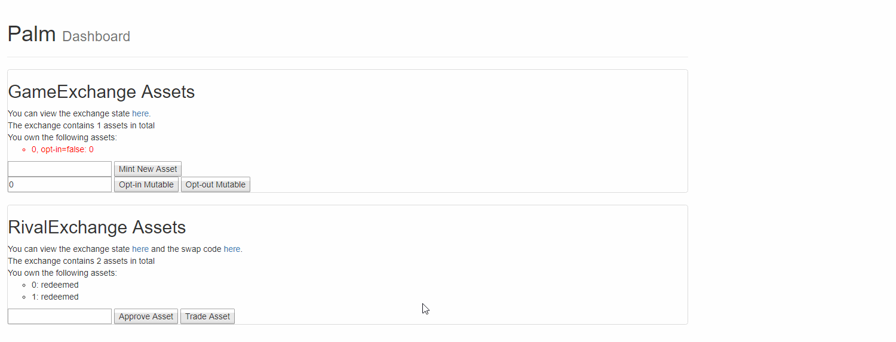
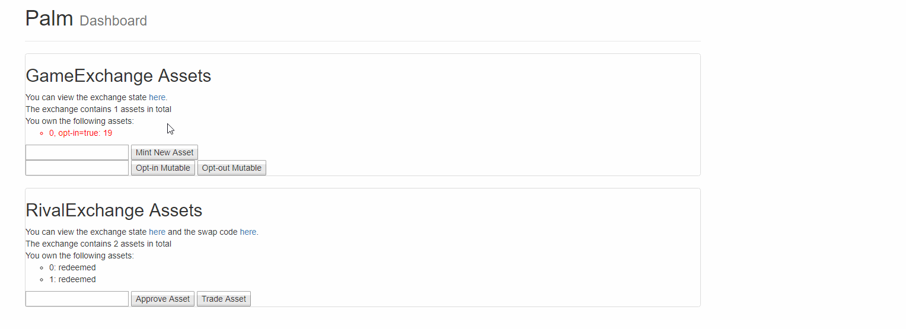
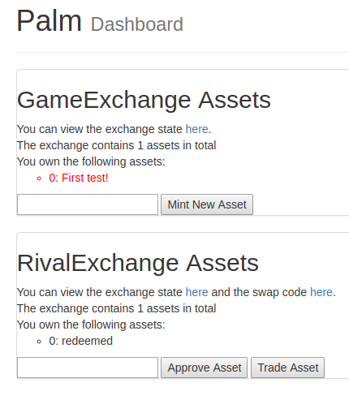
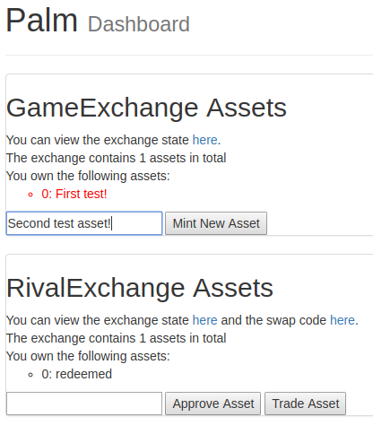
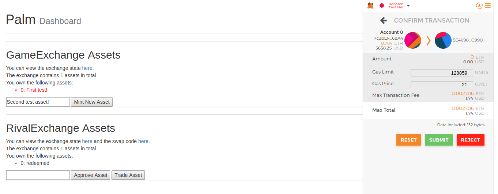
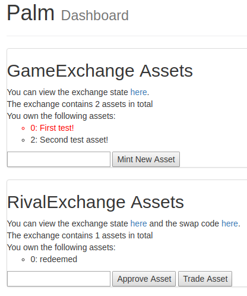
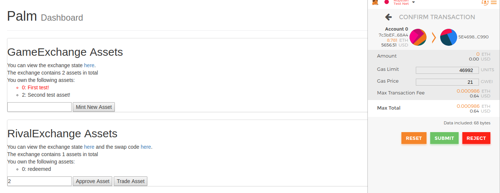
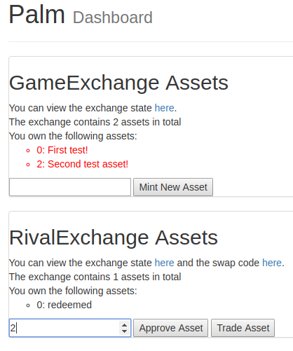
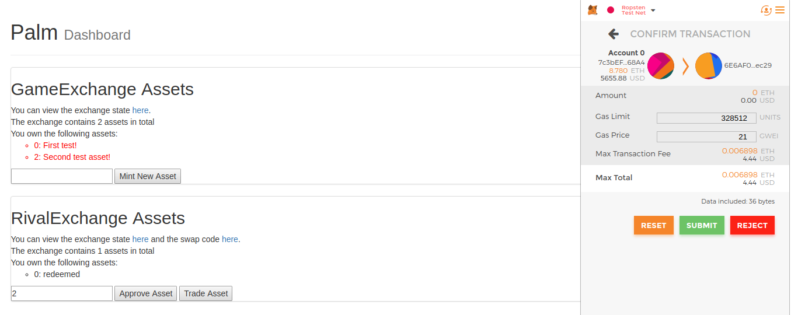
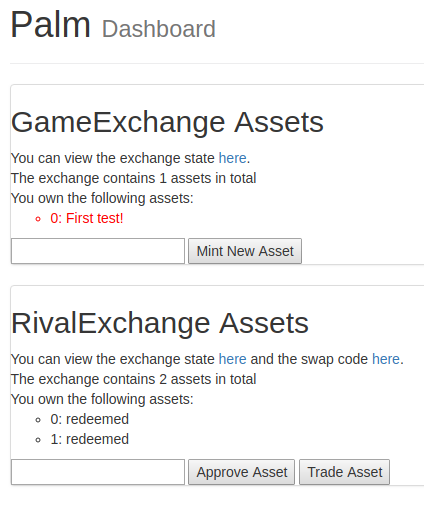

# Palm

Palm is the continuation of my work on [Galah](https://github.com/TimTinkers/Galah) to explore new and unique game development capabilities that integrating with the Ethereum blockchain can bring. Through the specific use of the [ERC-721](http://erc721.org/) standard for non-fungible assets, Palm considers just what can be accomplished with globally-available trustless game state.

  
  

In keeping with the precedent set by Galah, I've named the project after a large Australian parrot.1

## Motivation

The multibillion-dollar video game industry is increasingly adopting in-game purchases as an additional revenue source. Such in-game purchases are dubbed "microtransactions" and require players spend real-world money to unlock in-game content.2 Microtransactions are often criticized by players and have resulted in public relations disasters for the companies which implement them.3 Using the Ethereum blockchain, this project demonstrates a revision to the microtransaction model where players can purchase and truly own their in-game content.4,5

Ethereum is one of several blockchains popular among developers for its ability to execute useful code. With Ethereum, this is done using developer-defined "smart contracts." A developing standard in Ethereum is the ERC-721 "non-fungible token" to unify how contracts represent unique, individually-owned metadata. This standard enables a common "CryptoObject" where developers can store any information their applications use. Ethereum users can take irrevocable ownership of these objects and freely trade them with one another.

This project demonstrates techniques by which the [Unreal Engine](https://www.unrealengine.com/en-US/blog), a popular tool for developing video games, can interface with Ethereum contracts. Now developers can use the CryptoObject contracts to represent, sell, and interact with their in-game content. The controversial microtransaction model is altered: players no longer pay to just unlock content restricted to a single game. Instead, they attain real ownership. Player-owned content can be exchanged with others or used in multiple games.

**Palm demonstrates how Ethereum empowers the free trade of online game content.**

## Exchange Trust Model

Typically, real-time video games simulate their world using a fixed simulation timestep known as the "tick rate." For example, Valve Corporation's popular multiplayer first-person shooter _Counter-Strike: Source_ supports servers with a tick rate of 66Hz.6 That is, the game servers update state 66 times per second. Game logic, physics simulations, and player input signals are all processed in frequent, discrete time quanta. These state updates are decoupled from the client-side rendering frame rate, allowing for smooth rendering to be maintained across a variety of tick rates.

Real-time games can update their state more frequently than transaction times for Ethereum can currently support. The all-time peak transaction rate for the Ethereum network was 15.6 transactions per second.7 Even games with less frequent tick rates like Epic Games' _Fortnite_ outpace this peak transaction rate.8

It is currently infeasible for a real-time game to track and update its state directly on Ethereum, even if its tick rate was dramatically reduced. The time it takes to interact with Ethereum and wait for a miner to commit a state update transaction to the chain is variable. A fixed tick rate is not currently possible to maintain, which makes processing logic, physics, and input much more difficult. Lastly, operating the game server would require constantly burning gas for small, short-lived updates and would be very costly.

Clearly, traditional servers are more appropriate than Ethereum for handling the frequent game state updates required to simulate a multiplayer game. What role then, if any, can Ethereum play in video games?

||
|:-:|
|A hybrid trust model similar to a cryptocurrency exchange can overcome many scalability issues.|

The contracts, web server, and interface shown used in the following demonstration are available in the [GameExchangeContract](https://github.com/TimTinkers/Palm/tree/master/GameExchangeContract) folder of this repository. The interface shown above is a simple page using [web3.js](https://github.com/ethereum/web3.js/) to read state from and interact with a deployed instance of my [GameExchange](https://github.com/TimTinkers/Palm/blob/master/GameExchangeContract/contracts/GameExchange.sol) contract.

The solution that Palm explores is a hybrid trust model where players can opt into and out of object modification from a centralized authority under the control of a game's developers. Instead of a game interacting with a player's on-chain objects in real time, the game can track state changes off-chain on a traditional server. Updates are only committed to the blockchain periodically.

This model is very similar to how large cryptocurrency exchanges operate: when users hold cryptocoins on an exchange, they typically don't own them on-chain. Instead, the off-chain cryptocoin accounting is centralized entirely on the exchange's servers. This model suffers from centralization in that users don't actually fully own their coins until withdrawing from the exchange to another wallet. However, the model benefits from being able to update its off-chain reckoning of state quicker and cheaper than interacting with the blockchain would allow.

When the player opts an object into modification, as they are shown doing above, they are consciously trusting the game authority to manage state updates to that object appropriately. A malicious or faulty game authority could manipulate the metadata of the object such that it destroys whatever value the object might have held. A malicious cryptocurrency exchange could steal coins in much the same fashion. When the player opts an object out of modification, they lock its state such that not even the game authority can manipulate it.

||
|:-:|
|Palm's example game is a simple shooting gallery where the player's high-scoring gun is tokenized.|

To demonstrate this model in action, Palm includes a simple game which tracks a player's high scores per gun as ERC-721 objects. The game includes a client built in the Unreal Engine and a separate Java server for interacting with the exchange contracts. The Unreal Engine client assets are available in the [TargetShootProject](https://github.com/TimTinkers/Palm/tree/master/TargetShootProject) folder of this repository. The Java server is available in the [TargetShootServer](https://github.com/TimTinkers/Palm/tree/master/TargetShootServer) folder.

The player is locked to a small shooting area and given a gun. The gun displays its all-time high score, which is recorded in a corresponding ERC-721 record. After the player shoots the red cube to trigger the start of a match, they have 30 seconds to shoot as many red popup figures as they can while avoiding green figures. The server tracks the player's score and updates the gun's display when new high scores are achieved.

After 30 seconds, the round ends and the server sees if the player has set a new record. Only then is the player's gun object, if they have opted for object modification, updated with the new high score. During the course of a match, all communication is directly between the Unreal Engine and the Java server. The gas and time costs of transacting with the blockchain are avoided until the player is done playing.

  

Taking a look back at the web interface, we can see that the server authority has modified the player's gun object to include the new high score. While this simple game trusts the client, in practice the game server would exist [separately from the client](https://gafferongames.com/post/what_every_programmer_needs_to_know_about_game_networking/) as a remote authority. The game authority would modify the player's gun object from a separate machine with separately signed transactions, preventing players from cheating.9

||
|:-:|
|The previous high score is retrievable from Ethereum and can be modified by the server when needed.|

The example above shows a player entering the game again for another match. Their previous high score persisted on the blockchain between their play attempts. In this gameplay clip, once the player surpasses their old high score, the gun object begins updating with the score value tracked on the remote centralized server. When the match ends, the newer high score is committed to the blockchain.

||
|:-:|
|Showing the even-higher high score from the second round, as well as the user opting-out.|

The player, satisfied with the high score of 19, chooses to opt out of object modification. This is a precautionary step to prevent the game authority from altering the player's high score on that gun object. In practice, because players must pay a small gas cost in transacting with Ethereum to opt into and out of object modification, likely player behavior will be to just fully trust the game authority to behave and remain opted in at all times.

The player might also be opting out in order to trade their gun object to someone. Exchanging objects actually requires the object to be opted out of modification. Palm has made this design decision in order to prevent sold objects from being modified without the buyer's consent; players can only transfer objects which are opted-out of modification. This model allows the buyer to know for certain that whatever object they purchase will be theirs in exactly the same state it was sold in. The edge-case where a buyer sees their recently-purchased item change because the seller is still playing with it has been handled.

## Using Objects in Multiple Games

One interesting use case of blockchain-based objects in games is the ability to seamlessly share objects between multiple games. One could imagine a situation where a player's [$28,000 of virtual hats](https://www.pcgamesn.com/tf2/28000-team-fortress-2-backpack) could be worn by characters across many different games. Player ownership of these collectable items becomes far more tangible: not only can they be made certifiably unique, but the objects also won't disappear even if the game they come from does. Their value can outlive the reason why they were originally purchased, and objects can find fresh life in newer titles.

Blockchain-backed ERC-721 objects can also be used to represent a player's identity and statistics as they move from one game to another. Maybe a player's skill in _Counter-Strike_ automatically entitles them to a higher rank in the next _Battlefield_ game. This raises an especially important point: the ERC-721 objects can be used by multiple games even if they don't have the same development team or same access to the modification authority. That is, every developer has read-access to a game's objects and can use that in their own game, even if they are unable to write to the object.

||
|:-:|
|An entirely different game without modification authority can read objects from other games.|

In the [GuessingGame](https://github.com/TimTinkers/Palm/tree/master/GuessingGame) folder, Palm includes a simple Java game which communicates with the deployed GameExchange contract. The guessing game generates a random number between 0 and 100 and the player has a limited number of guesses to find the number. The player is given notice if they guess near the actual number.

The guessing game is not a modifying authority to the TargetShootProject's gun objects. The guessing game does, however, use its read access to pull the player's high score from one of their player-specified owned gun objects. The number of guesses a player is given is equal to the high score they were able to achieve with their chosen guessing gun. While this is an extremely simple example, it does show what kind of interesting cross-game interactions can emerge from using this standard.

## Trustless Economy

Given how commonplace microtransactions are in modern games, it is clear that game developers want to monetize their in-game economies to produce an additional source of revenue. Developers want to do so in a manner which is guaranteed to be tamper-proof.

In-game currencies are prone to abuse when players exploit unknown bugs. Electronic Arts' failure to secure the in-game currency of their _FIFA_ series allowed it to be freely duplicated by players. One player, Ricky Miller, was actually prosecuted and plead guilty to conspiracy to commit fraud after [duplicating $16M worth of FIFA coins](https://www.theregister.co.uk/2017/05/02/video_game_hacker_probation/).11 In the face of concerted effort by players to exploit bugs in a game's trading and currency system, developers are incentivized to use a blockchain like Ethereum for its proven security.

Another concern for game developers where valuable virtual items are involved is legal liability surrounding what players choose to do with those objects on your platform. Valve Corporation, for example, briefly had to deal with lawsuits regarding [illegal skin gambling](https://esportsobserver.com/class-action-lawsuit-blaming-valve-illegal-skin-gambling-refiled-district-court/) on their platform. In their popular game _Counter-Strike: Global Offensive_, players can decorate their weapons with colorful "skins." Some of these skins are extremely rare and valuable. Players were using the in-game trading functionality to gamble valuable skins on the outcome of professional _Counter-Strike_ matches.12 Valve's liability concerns were how responsible they were for the illegal activity of players using their trade platform.

For developers using a public blockchain like Ethereum as the platform for executing all transfers of in-game objects between players, the liability concerns seem diminished _(Tim Clancy is not a lawyer)_. If players choose to gamble with the ERC-721 records from your game, you have no way to stop them. They could build out their own infrastructure on Ethereum and the gambling behavior would exist in a format that you provably have no control over.

## Interactions in the Trustless Economy

This section of the project observes the possible interactions between ERC-721 object exchanges for two competing games. It deals specifically with two instances of the GameExchange contract deployed live to the Ropsten test network, ["GameExchange"](https://ropsten.etherscan.io/address/0x5e469871e80474e231af5c252471b6d6817fc990) and ["RivalExchange"](https://ropsten.etherscan.io/address/0x09099905e4f5e8383ee33b843eeea014be4f8037). The destruction of objects from one exchange in facilitating the creation of objects on another is handled by the [deployed "SwapAndBurn"](https://ropsten.etherscan.io/address/0x6e6af08a1fa2fd0837dbdd01448c8ec36f63ec29) contract whose source is available [here](https://github.com/TimTinkers/Palm/blob/master/GameExchangeContract/contracts/SwapAndBurn.sol).

||||
|:-:|:-:|:-:|
|Two exchanges.|Minting object.|Confirming mint.|

...

|||
|:-:|:-:|
|Object minted.|Requesting approval.|

...

||||
|:-:|:-:|:-:|
|Approval successful.|Requesting trade.|Trade successful.|

...

## Conclusion

...

## References
The following resources are important references for the information presented in this project:
1. The Palm Cockatoo image is the work of [Reg Mckenna](https://www.flickr.com/photos/whiskymac/), released [CC BY 2.0](https://creativecommons.org/licenses/by/2.0/).
2. Davidovici-Nora, M.: Paid and Free Digital Business Models Innovations in the Video Game Industry. Institut Mines-Telecom, 83-102 (2014).
3. [Most Downvoted Comment](https://www.pcgamer.com/the-most-downvoted-comment-in-reddit-history-is-now-a-star-wars-battlefront-2-mod/), [Electronic Arts](https://www.ea.com/) received massive microtransaction backlash in this [reddit thread](https://www.reddit.com/r/StarWarsBattlefront/comments/7cff0b/seriously_i_paid_80_to_have_vader_locked/).
4. Olsson, B., Sidenblom, L.: Business Models for Video Games. Department of Informatics, Lund University, 5-50 (2010).
5. Švelch, J.: Playing with and against Microtransactions. The Evolution and Social Impact of Video Game Economics. p. 102-120 Lexington Books, London (2017).
6. [Valve Networking Guide](https://developer.valvesoftware.com/wiki/Source_Multiplayer_Networking), an excellent primer on multiplayer game networking with specifics for Valve titles.
7. [Ethereum Transaction Rate](https://etherscan.io/chart/tx), as of 4/25/2018 the rate peaked at 1,349,890 transactions on 1/4/2018.
8. [Battle Royale Tick Rates](https://www.youtube.com/watch?v=u0dWDFDUF8s), an analysis of the tick rates in several multiplayer games of the battle royale genre.
9. [Gaffer On Games](https://gafferongames.com/post/what_every_programmer_needs_to_know_about_game_networking/), an authority on the importance and details of authoritative game networking.
10. [Expensive Team Fortress 2 Backpack](https://www.pcgamesn.com/tf2/28000-team-fortress-2-backpack), real money accrues in game objects, like $28k of virtual hats.
11. [FIFA Coin Heist](https://www.theregister.co.uk/2017/05/02/video_game_hacker_probation/), a group reverse-engineered enough of FIFA to exploit a currency-duplication bug.
12. [Valve Skin Gambling](https://esportsobserver.com/class-action-lawsuit-blaming-valve-illegal-skin-gambling-refiled-district-court/), Valve faced some lawsuits regarding players illegally gambling using their in-game objects.

## Supporting Projects
I'd like to thank the following guides, tools, and projects which greatly supported the development of Palm:
- [ERC-721](http://erc721.org/), a good primer on the developing Ethereum standard.
- [Unreal Engine 4](https://www.unrealengine.com/en-US/blog), the Unreal Engine is a free high-quality game and physics engine.
- [Ethereum JavaScript API](https://github.com/ethereum/web3.js/), web3.js provides the wrappers needed to integrate with smart contracts on the web interface.
- [The Online ABI Encoding Tool by HashEx](https://abi.hashex.org/), to convert constructor parameters to ABI encoding for verification.
- [Etherscan](etherscan.io), for providing an easy interface to validate deployment and contract state.
- [JavaScript Promises in Web3](http://shawntabrizi.com/crypto/making-web3-js-work-asynchronously-javascript-promises-await/), this article provides an overview on converting Web3 calls to Promises seamlessly.
- [Truffle](https://github.com/trufflesuite/truffle), a development environment, testing framework and asset pipeline for Ethereum.
- [Infura](https://infura.io/), a gateway for cloud-hosted Ethereum nodes.
- [Web3j](https://web3j.io/), a lightweight, reactive, type-safe Java and Android library for integrating with nodes on Ethereum blockchains.
- [LowEntry Socket Connection](https://www.unrealengine.com/marketplace/low-entry-socket-connection), a useful networking plugin for the Unreal Engine with native Java integration.
- [json-simple](https://github.com/fangyidong/json-simple), a simple and fast JSON parser.
- [solc-js](https://github.com/ethereum/solc-js), JavaScript Solidity compiler bindings used here to create the Java contract wrapper.
